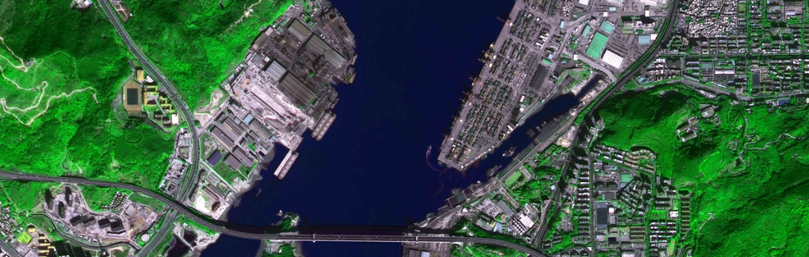

# B3-CDG: A Pseudo-Sample Diffusion Generator for Bi-temporal Building Binary Change Detection

Peng Chen, Peixian Li*, Bing Wang, Sihai Zhao, Yongliang Zhang, Tao Zhang，Xingcheng Ding

[[`Paper`](https://www.sciencedirect.com/science/article/pii/S0924271624003988#s0125)]  [[`Dataset`](...)] [[`App`](...)]

## Latest updates

We are pleased to announce that the source code and related datasets for our ISPRS paper, **[B3-CDG: A Pseudo-Sample Diffusion Generator for Bi-temporal Building Binary Change Detection]**, will be made available shortly.

### Contents

- **Source Code:** This includes the implementation details and instructions for reproducing our results.
- **Datasets:** The datasets used in our study will be provided to facilitate further research and validation.
- **App:** A user-friendly application for running inferences based on our models will also be included.

**Thank you for your interest in our work!**

